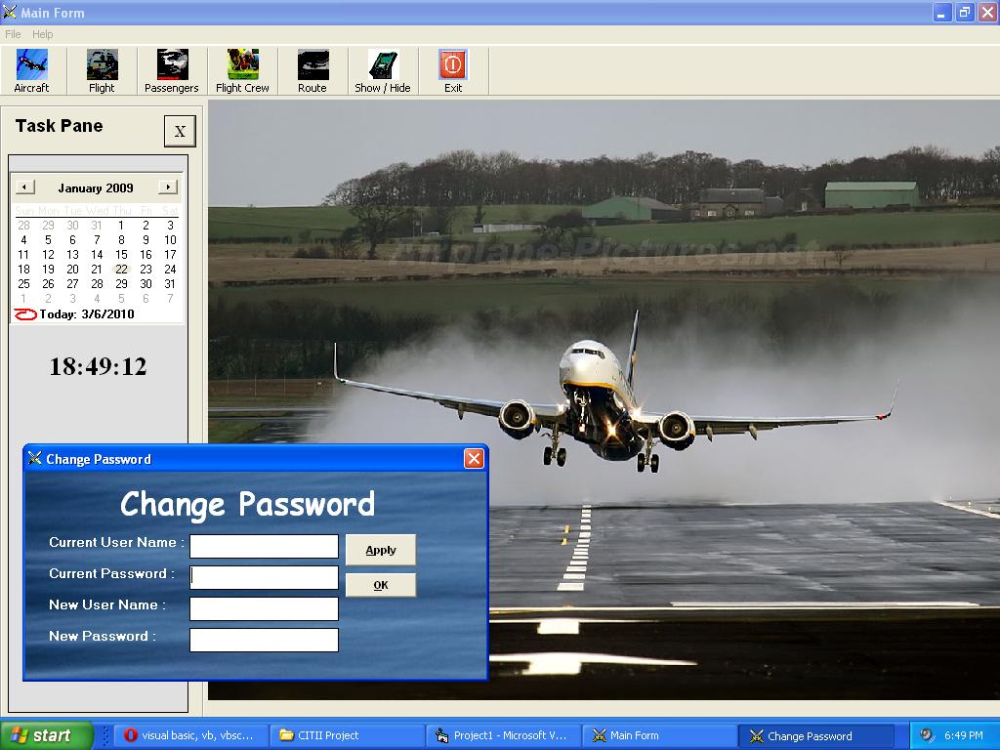



## Air Line Reservation History System

### Description

This code is all about the information that we can save in our data base. With the help of this application any one can learn so many things and can also understand the concept of Database.

If any one found any error in it so email me at meetamazefaraz@hotmail.com.

Please vote for me. Thanks
 
### More Info
 
Input paramaters contain int char strings and others.

A new should see this because it totally based on simple programming which will help him to increase his knowledge about VB 6

No, it does'nt return any value it just can save the provided information.

No side effects are included.

             |
---                |---
**Submitted On**   |2010-03-06 18:49:20
**By**             |[Muhammad Faraz Shaikh](https://github.com/Planet-Source-Code/PSCIndex/blob/master/ByAuthor/muhammad-faraz-shaikh.md)
**Level**          |Beginner
**User Rating**    |4.9 (44 globes from 9 users)
**Compatibility**  |VB 6\.0
**Category**       |[Databases/ Data Access/ DAO/ ADO](https://github.com/Planet-Source-Code/PSCIndex/blob/master/ByCategory/databases-data-access-dao-ado__1-6.md)
**World**          |[Visual Basic](https://github.com/Planet-Source-Code/PSCIndex/blob/master/ByWorld/visual-basic.md)
**Archive File**   |[Air\_Line\_R217633362010\.zip](https://github.com/Planet-Source-Code/muhammad-faraz-shaikh-air-line-reservation-history-system__1-72971/archive/master.zip)

